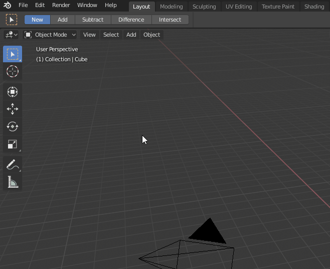
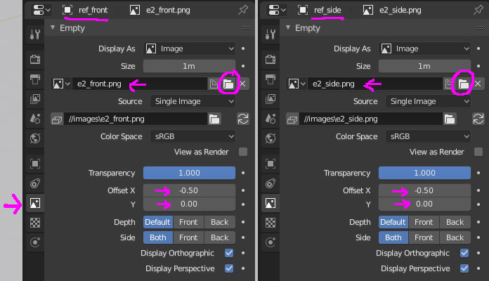

# Character Modeling in Blender

Resources for Boston Blender character modeling meetup.

---

## Shortcuts

### General

| Shortcut | Action |
| ---- | ---- |
| **alt-Q** | quad view |
| **N** | toggle sidebar |
| **T** | toggle toolbar |
| **Z** | shading mode |
| **shift-Z** | toggle wireframe/solid shading |
| **alt-Z** | toggle xray shading |
| **shift-A** | add object |
| **tab** | toggle object/edit mode |
| **ctrl-A** | apply transformation |

### Mesh Modeling

| Shortcut | Action |
| ---- | ---- |
| **X** | delete object/component |
| **ctrl-R** | subdivide |
| **K** | knife tool |
| **alt-LMB** | select edge loop |
| **, (comma)** | orientation menu |
| **** | |
| **** | |
| **** | |
| **** | |
| **** | |
| **** | |
| **** | |

### NURBS Hair Modeling

| Shortcut | Action |
| ---- | ---- |
| **alt-S** | scale at control point |
| **ctrl-T** | rotate at control point |
| **ctrl-L** | select linked |
| **shift-D** | duplicate |

## User Preferences

I modified some shortcuts for easier and faster workflow.

| Shortcut | Action |
| ---- | ---- |
| **Q** | box select tool |
| **shift-Q** | lasso select tool |
| **W** | move tool |
| **shift-W** | move mode |
| **E** | rotate tool |
| **shift-E** | rotation mode |
| **R** | resize tool |
| **shift-R** | resize mode |
| **1,2,3,4** | vertex, edge, face, uv selection mode |
| **alt-1,2,3,4** | front, perspective, right, top view |
| **MMB** | pan camera |
| **alt-MMB** | tumble camera |
| **wheel** | dolly camera |
| **F** | focus camera on selection |

To use my preferences:

* go to the blender 2.80 config folder
  * windows: `%APPDATA%\Blender Foundation\Blender\2.80\config`
  * osx: `/Users/_YOUR_USER_NAME_/Library/Application Support/Blender/2.80/config`
  * linux: `~/.config/blender/2.80/config`
* make a backup of the `userpref.blend` file
* copy the `userpref.blend` file from this project to the config folder
* in **blender** select my keyboard profile (Lajos) in **Edit/Preferences/Keymap**
  * you can still use the original **Blender** shortcuts by selecting that profile

This is what the config folder looks like on windows (the original `userpref.blend` renamed to `userpref.blend.bak`; there might be more or less files in there):

To change keymap:

---

## Add reference images

To load the reference ortho images, first add two empty image objects: **Add/Empty/Image** (you can also use the **shift-A** shortcut):

I named the objects **ref_front** and **ref_right**.

Set the location and rotation for the image objects in the **Object** tab:

Load the images in the **Object Data** tab for each image object. Make sure to set **Offset X** to **-0.5** and **Offset Y** to **0** so the images line up to the ground and center of the world:

Create a new **collection** for the reference images in the **Outliner**:

Notice the **cursor**, **eye** and **camera** icons next to collections and objects:

* **cursor** - enable/disable selection of object or collection
* **eye** - show/hide object or collection in viewport
* **camera** - show/hide object or collection in renders

