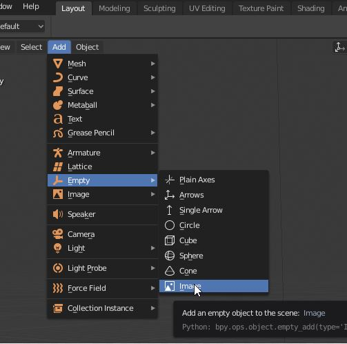
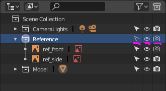
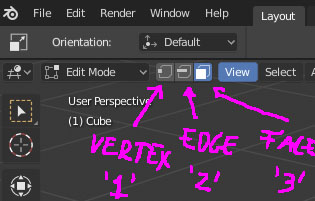
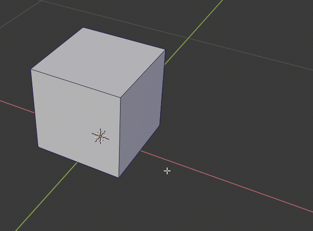
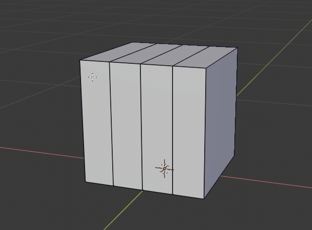
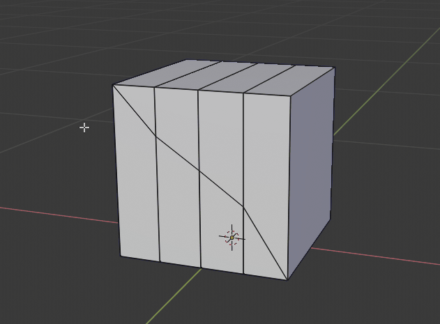
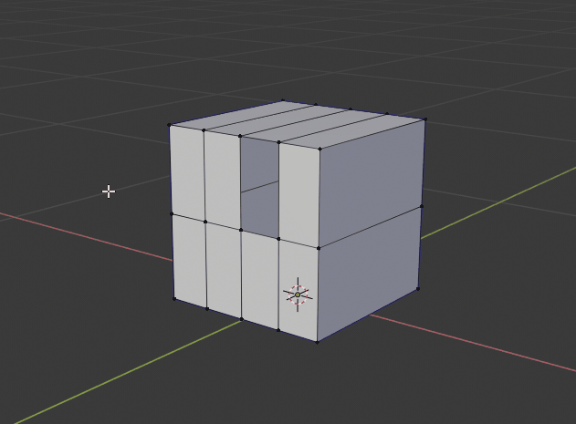
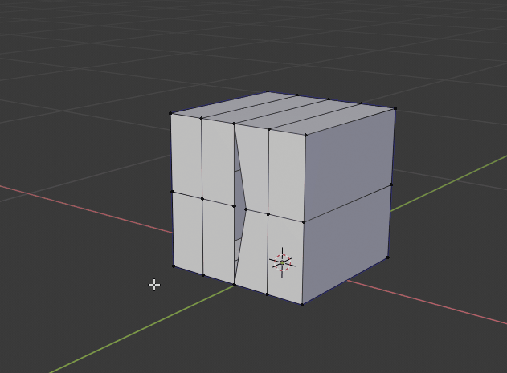

# Character Modeling in Blender

Resources for Boston Blender character modeling meetup.

---

## Shortcuts

### General

| Shortcut | Action |
| ---- | ---- |
| **alt-Q** | quad view |
| **N** | toggle sidebar |
| **T** | toggle toolbar |
| **Z** | shading mode |
| **shift-Z** | toggle wireframe/solid shading |
| **alt-Z** | toggle xray shading |
| **shift-A** | add object |
| **TAB** | toggle object/edit mode |
| **ctrl-A** | apply transformation |

### Mesh Modeling

| Shortcut | Action |
| ---- | ---- |
| **X** | delete object/component |
| **ctrl-R** | loop cut |
| **K** | knife tool |
| **alt-LMB** | select edge loop |
| **, (comma)** | orientation menu |
| **M** | merge (join vertices) |
| **V** | rip (split vertices) |
| **shift-F** | fill polygon (make faces) |

### NURBS Hair Modeling

| Shortcut | Action |
| ---- | ---- |
| **alt-S** | scale at control point |
| **ctrl-T** | rotate at control point |
| **ctrl-L** | select linked |
| **shift-D** | duplicate |

## User Preferences

I modified some shortcuts for easier and faster workflow.

| Shortcut | Action |
| ---- | ---- |
| **Q** | box select tool |
| **shift-Q** | lasso select tool |
| **W** | move tool |
| **shift-W** | move mode |
| **E** | rotate tool |
| **shift-E** | rotation mode |
| **R** | resize tool |
| **shift-R** | resize mode |
| **1,2,3,4** | vertex, edge, face, uv selection mode |
| **alt-1,2,3,4** | front, perspective, right, top view |
| **MMB** | pan camera |
| **alt-MMB** | tumble camera |
| **wheel** | dolly camera |
| **F** | focus camera on selection |

To use my preferences:

* go to the blender 2.80 config folder
  * windows: `%APPDATA%\Blender Foundation\Blender\2.80\config`
  * osx: `/Users/_YOUR_USER_NAME_/Library/Application Support/Blender/2.80/config`
  * linux: `~/.config/blender/2.80/config`
* make a backup of the `userpref.blend` file
* copy the `userpref.blend` file from this project to the config folder
* in **blender** select my keyboard profile (Lajos) in **Edit/Preferences/Keymap**
  * you can still use the original **Blender** shortcuts by selecting that profile

This is what the config folder looks like on windows (the original `userpref.blend` renamed to `userpref.blend.bak`; there might be more or less files in there):

To change keymap:

---

## Add reference images

To load the reference ortho images, first add two empty image objects: **Add/Empty/Image** (you can also use the **shift-A** shortcut):

I named the objects **ref_front** and **ref_right**.

Set the location and rotation for the image objects in the **Object** tab:

Load the images in the **Object Data** tab for each image object. Make sure to set **Offset X** to **-0.5** and **Offset Y** to **0** so the images line up to the ground and center of the world:

Create a new **collection** for the reference images in the **Outliner**:

Notice the **cursor**, **eye** and **camera** icons next to collections and objects:

* **cursor** - enable/disable selection of object or collection
* **eye** - show/hide object or collection in viewport
* **camera** - show/hide object or collection in renders

---

## Extrude

We'll use extrusion as one of the tools to add geometry to our model.

First make sure that you are in **Edit Mode** (**TAB** key) and in **Face** selection mode (**3** key with my awesome keymap):

Select a face or multiple faces. You can use the **Face/Extrude Faces** menu or **ctrl-E** shortcut.

After the extrusion you can move the new faces, or for more control hit **ESC** to exit the automatic move mode and use the move tool (**W** key). You can also scale and rotate the new faces.

---

## Loop Cut

We can add resolution to our model by creating new edge loops with the **Loop Cut** tool, **ctrl-R** shortcut.

Make sure **Edge** selection mode is active.

The loop cut tool is context sensitive, it will create new loops based on the orientation of the closest edge to the mouse cursor.

When the loop cut tool is active, the number of new loops can be adjusted by turning the mouse wheel. After clicking the **LMB**, the new edges can be moved, or to leave them in the center, hit the **ESC** key.

---

## Knife Tool

Another tool for creating new edges is the **Knife Tool** (**K** shortcut).

Make sure to start and end on a vertex to avoid adding unwanted vertices (notice the red outline around the green cursor when hovering over a vertex).

---

## Removing Edges

We can remove edges using the delete popup menu (**X** key).

Notice that the **Delete Edges** option also deletes the face, making a hole on the object. A better operation is **Dissolve Edges** that leaves the face intact.

Vertices and faces can also be removed using the same menu.

---

## Filling in Holes

To fill in a hole (create a new face), select the vertices around the hole and use the **shift-F** shortcut (the operation is **New Edge/Face from Vertices** in the **Vertex** menu)

---

## Meging Vertices

Multiple vertices can be welded together from the **Merge** popup menu, the shortcut is **M**.

In this case we want to fix a slit in the object. The screen left vertex is in the correct position. First select the right vertex then the left one and use the **At Last** option from the **Merge** menu to weld the vertices at the position of the last selected vertex.

---
